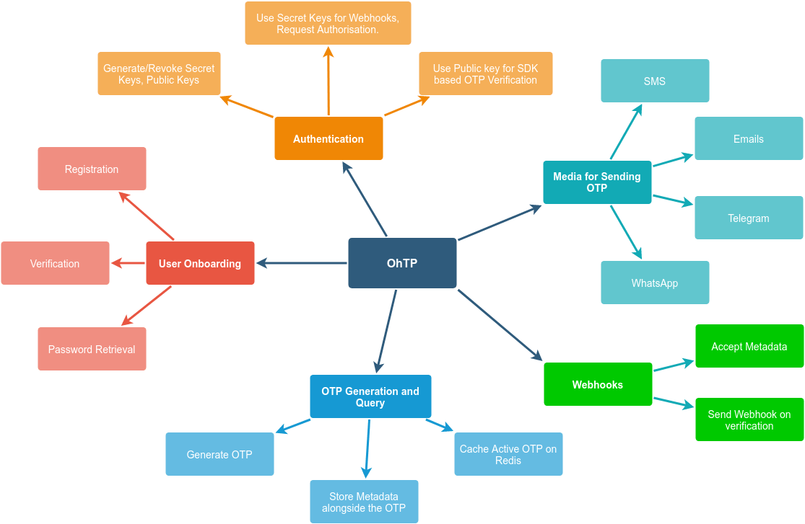

# OhTP

### A Secured Authentication Solution

Secured systems are highly sort after but hard to create. OhTP provides a secure pipeline for your customer faing authentication needs.
### The Why

If you have ever tried to implement an authentication system from scratch, you would know how tasking it could be. OhTP helps to abstract the complexity by integrating with your software system via webhooks and API calls. You can authenticate your users by various means and not have to deal with how the authentication is carried out. 

Here is [an article](https://taiwodevlab.hashnode.dev/building-ohtp-an-otp-solution-part-1-ckqdm9pl30b5zgss11vie5b0q) explaining why I am building this.

A rough representation of the system is as shown below.



## Project Status 
The project is under development.

## Built With

- [Nodejs](https://nodejs.org/en/)
- [MoleculerJS](https://moleculer.services/docs/0.14/)
- [PostgreSQL](https://www.postgresql.org/)

## Features

- [x] is able to generate a strong OTP and send it to the recipient.
- [x] is able to send this OTP via SMS.
- [x] is able to send this OTP via email 
- [ ] is able to send this OTP via WhatsApp.
- [ ] is able to send this OTP via telegram.
- [ ] is easily extensible via plugins to support any medium of choice.
- [ ] is able to verify the OTP and send webhooks to the parent project.
- [ ] can be verified via URL, web SDK and API. After which a webhook is sent to a designated Endpoint.
- [x] be queried for all egress communication within any time interval.
- [x] send any metadata along with the webhook.

### Installation

To get started, you would need to create a local copy (clone) of the code on your machine. This is done by executing 
```bash
git clone https://github.com/teezzan/ohtp
```
Next is to enter the directory and install the required library. This can be done by the following.
```bash 
cd ohtp
npm install
```


## Authors

**[Taiwo Yusuf](https://github.com/teezzan/)**


## License
This project is licensed under the MIT License - see the [LICENSE.md](LICENSE.md) file for details.

